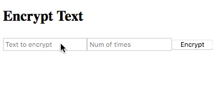

## Encryption Engine

A simple encryption (and decryption) engine built in Elm, with a basic front-end rendering a form and output. Back-end logic is fully tested and TDD'd. Basic documentation is provided as comments in the Elm source files. 

Please be aware when using the front-end that copy and pasting **does not preserve additional whitespace**, meaning that copying output from the encryption engine directly into the decryption engine **may not always produce accurate results**. Always ensure that whitespace is entered accurately into the decryption form before running the engine.

### Algorithm

Take every second character from a string, then the other characters that are not every second character, and concat them as a new string:

``This is a test!`` --> <code>hsi&nbsp;&nbsp;etTi sats!</code>

This can be done n times:

``This is a test!`` ( 2 ) --> ``s eT ashi tist!``

The decryption engine also operates in exactly the same way, returning an original string from encrypted text.

In both cases, if input-string is null/empty or if n <= 0, the original input text is returned.

## Run

**Requirements:** local Elm installation with elm-test also installed.

cd into the project root.

``elm reactor`` to host the front-end at ``localhost:8000``. The encrypt/decrypt engines can be interacted with in a browser by clicking on the Elm files themselves.

To engage with the engine directly from within the Elm Repl, import the Encrypt and Decrypt modules (exposing all functions) and enter parameters in the form of Function - Int - String e.g. ``encryptString 1 "This is a test!"``

``elm-test`` to run the full test suite.
